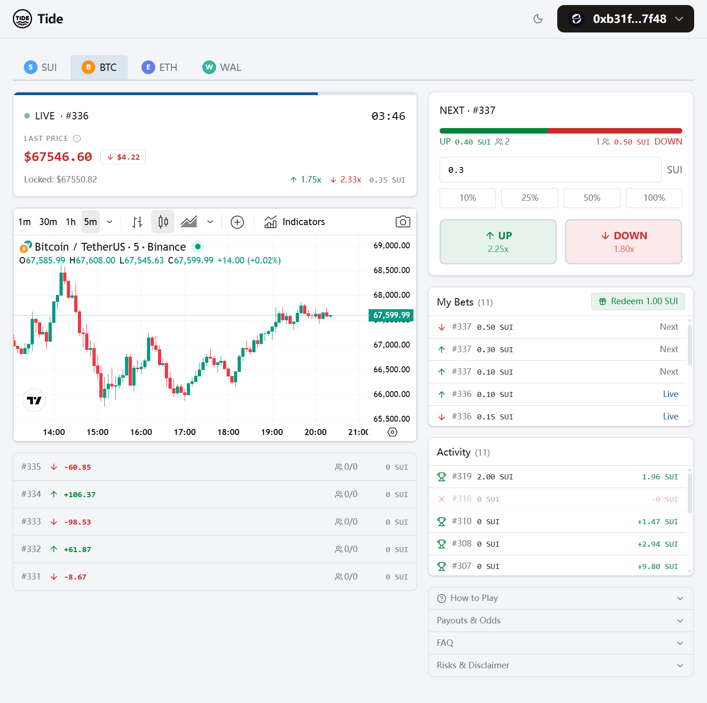

# Tide

价格涨跌预测竞猜 DApp，部署在 Sui 区块链上。用户对指定币种在固定时间窗口内的价格走势（上涨或下跌）进行预测下注，猜对者按比例瓜分奖池。

> 取名 "Tide"（潮汐）源自价格曲线如潮汐般起伏的特征



## 玩法设计

### 基本流程

1. **选择市场** — 选择一个交易对（SUI/USD、BTC/USD、ETH/USD、WAL/USD），每个市场以 5 分钟为一轮
2. **预测下注** — 在"下一轮"（NEXT）开始前，选择 UP（看涨）或 DOWN（看跌），投入 SUI 代币
3. **等待结算** — 轮次结束时，系统对比开盘价与收盘价判定涨跌
4. **领取奖励** — 猜对方向的玩家按投注金额比例瓜分整个奖池（扣除 2% 手续费后）

### 结算规则

| 场景 | 处理方式 |
|------|---------|
| 有赢家 | 赢家按投注比例瓜分奖池（扣 2% 手续费） |
| 全员猜错 | 奖池归协议金库 |
| 异常取消 | 全额退款 |

### 轮次生命周期

```
UPCOMING（可下注）→ LIVE（进行中，等待结算）→ SETTLED（已结算，可领奖）
```

每次结算自动推进：结算当前 LIVE 轮 → UPCOMING 轮变为 LIVE → 创建新的 UPCOMING 轮。

## 项目架构

```
┌──────────────────┐     ┌──────────────────┐     ┌──────────────────────┐
│     Frontend     │     │      Keeper      │     │    Move Contract     │
│     (React)      │────>│   (TS Script)    │────>│    (Sui on-chain)    │
│                  │     │                  │     │                      │
│ - 投注 / 领奖    │     │ - 自动结算 + 推进 │     │ - 核心业务逻辑       │
│ - 价格图表       │     │ - 拉取 Pyth 价格  │     │ - 资金管理           │
│ - 投注记录       │     │ - 异常恢复        │     │ - 状态管理           │
└──────────────────┘     └────────┬─────────┘     └──────────────────────┘
                                  │
                           ┌──────▼──────┐
                           │ Pyth Hermes │
                           │  (价格预言机) │
                           └─────────────┘
```

### 合约层（Move）

4 个核心模块：

- **registry** — 全局配置（手续费率、结算奖励、价格容差）、协议金库、市场列表
- **market** — 市场对象与轮次管理，`settle_and_advance` 为核心结算函数
- **bet** — 下注（`place_bet`）与领奖（`redeem`），Ticket 对象作为投注凭证
- **events** — 链上事件定义（BetPlaced、Redeemed、RoundSettled 等）

结算为 permissionless 设计：任何人都可以调用结算，结算者获得手续费的 2% 作为激励。

### Keeper 服务

自动化结算机器人，确保轮次按时推进：

- 为每个市场维护独立定时器，在轮次到期时自动触发结算
- 从 Pyth Hermes 拉取历史价格（`/v2/updates/price/{timestamp}`）并提交上链
- 多轮追赶：如果错过结算窗口，自动暂停并恢复市场
- 健康检查端口（9090）和运行指标统计

### 前端

- **价格图表** — 基于 TradingView Lightweight Charts 的实时K线图
- **投注面板** — 选择方向（UP/DOWN）、设置金额、一键下注
- **实时轮次** — 当前 LIVE 轮倒计时和赔率展示
- **投注记录** — 用户持有的 Ticket，支持批量领奖
- **活动历史** — 通过链上事件查询投注和领奖记录
- **市场切换** — 多市场标签页（SUI、BTC、ETH、WAL）

## 技术栈

| 层级 | 技术 |
|------|------|
| 智能合约 | Sui Move (Edition 2024) |
| 价格预言机 | Pyth Network (Hermes + Sui 集成) |
| 前端 | React 19 + TypeScript + Tailwind CSS 4 + Sui dApp Kit |
| Keeper | TypeScript + @mysten/sui + @pythnetwork/pyth-sui-js |
| 部署 | Walrus Sites (GitHub Actions CI/CD) |

## 项目结构

```
tide/
├── move/tide/             # Sui Move 合约
│   ├── sources/
│   │   ├── registry.move  # 全局配置与金库
│   │   ├── market.move    # 市场与轮次管理
│   │   ├── bet.move       # 下注与领奖
│   │   └── events.move    # 事件定义
│   └── tests/             # 合约测试
├── keeper/                # 自动结算服务
│   └── src/
│       ├── keeper.ts      # 主事件循环
│       ├── catchUp.ts     # 多轮结算与异常恢复
│       ├── pyth.ts        # Pyth 价格获取
│       └── transactions/  # PTB 构建器
├── ui/                    # React 前端
│   └── src/
│       ├── components/    # UI 组件
│       ├── hooks/         # 数据查询 hooks
│       ├── tx/            # 交易构建
│       └── lib/           # 常量、类型、工具函数
├── docs/                  # 设计文档
│   ├── contract.md        # 合约对象模型与函数接口
│   ├── oracle.md          # 预言机选型与结算机制
│   └── frontend.md        # 前端页面与数据查询策略
└── .github/workflows/     # CI/CD
    └── deploy-site.yml    # Walrus Sites 自动部署
```

## 部署信息

### 合约（Sui Testnet）

| 项目 | 地址 |
|------|------|
| Package | `0x0a76de200415689e73b53498a4cef8cba2c6befd92f779fcfbc4a566321e14f7` |
| Registry | `0x102f49591cccd726dd6604c1e0a2cca041c981a47100dc0081b551f59d06d4ee` |

### 已部署市场

| 市场 | 时间窗口 | 价格源 |
|------|---------|--------|
| SUI/USD | 5 分钟 | Pyth SUI/USD |
| BTC/USD | 5 分钟 | Pyth BTC/USD |
| ETH/USD | 5 分钟 | Pyth ETH/USD |
| WAL/USD | 5 分钟 | Pyth WAL/USD |

### 前端

通过 GitHub Actions 自动部署至 [Walrus Sites](https://walrus.site)，推送 `master` 分支的 `ui/` 变更即触发构建与部署。

## 安全设计

**合约安全：** Sui Move 所有权模型天然防重入；整数运算默认溢出检查；AdminCap 权限隔离；结算为 permissionless 设计。

**预言机安全：** 依赖 Pyth 多数据源聚合价格；价格时间戳单向约束（`[round_start, round_start + tolerance]`）防止选择性提交；Feed ID 硬校验防止错误价格源。

**经济安全：** 最低投注额防 dust attack；手续费按结算统一收取；异常时可暂停单个市场并取消进行中轮次，投注者全额退款。

## 参考资料

- [Pyth Network Sui 集成文档](https://docs.pyth.network/price-feeds/core/use-real-time-data/pull-integration/sui)
- [Pyth 价格 Feed ID 列表](https://docs.pyth.network/price-feeds/price-feeds)
- [Sui Move 开发文档](https://docs.sui.io/concepts/sui-move-concepts)
- [Sui dApp Kit](https://sdk.mystenlabs.com/dapp-kit)
